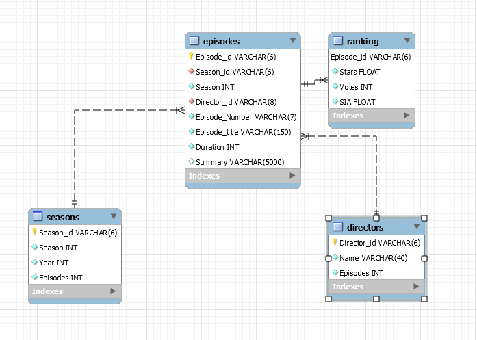

# API Sentiment Project

This project consists of the creation of a database using `Flask` to create it, add information and consult it by means of APIs.

For this I have created a database in `SQL` with the information of the different seasons of `Friends`, this database includes:
* Episodes
* Directors 
* Summary
* Seasons
* Rates & Votes

# Index

* Documents
* Steps
* APIs
* Programms
* Python libraries

# Documents

* 01 - **Kaggle.py**: Data collection executable and `Sentimen Analysis` of data.
* 02 - **SQL Jupyter**: database creation from jupyter.
* 03 - **Visualization**
* 04 - Draft Notebooks:
    * Kaggle.
    * Sentiment Analysis.

# Steps

* `Step 1`: Select the dataset from  [Kaggle](https://www.kaggle.com/rezaghari/friends-series-dataset?select=friends_episodes_v3.csv)
        
* `Step 2`: make the sentiment analysis of the data.

* `Step 3`: Clean-up the dataset and export it in `.csv` format..

* `Step 4`: take the information obtained in the two previous steps and add it to `SQL DataBase`.

* `Step 5`: create the necessary `endpoints` to get or post information.

# SQL DataBase 

# APIs

Using the get method the client gets a set of data in `Json` format by making a call to the url specified for each case. This can be done with the requests library in this way:

    `url_data = "http://localhost:5000/" + url
    response = requests.get(url = url_data).json()
    return pd.read_json(response)`

To do this you must create a dictionary and upload the data to the database using the POST method. This can be done with the requests library in this way: 

    `nuevo_dir = {'Director_id':'D_pep',
        'Name':'Pepito Perez',
        'Episodes':3}`

    `url_dir = "http://localhost:5000/new_director"`

    `requests.post(url_dir, data = nuevo_dir)`

Different APIs are created in order to allow the clients get or post information, some of this APIs are:

* **Get**: this method give information to the client. 
    * [Get episodes by name](http://localhost:5000/episodes_name/)
    * [Get episodes by season](http://localhost:5000/episodes_temp/)
    * [Get episodes by director](http://localhost:5000/episodes_by_director/)
    * [Get all info](http://localhost:5000/all_info)
    
* **POST**: this method allows the client to post information. 
    * [POST new director](http://localhost:5000/new_director/")
    * [POST new season](http://localhost:5000/new_season/")
    * [POST new episode](http://localhost:5000/new_episode/)
    * [POST new rank](http://localhost:5000/new_rank/)

# Sentiment Analysis

Using `NLP & Text Sentiment Analysis` I made an emotional analysis of the data, finding out which are the most and the least emotional episodes from the different seasons of `Friends`.
    

# Programs

* Python
* Jupyter NoteBook
* Visual Code

# Python libraries

* Pandas
* Seaborn
* Json
* Requests
* Mathplotlib
* Numpy
* SQL Alchemy
* Getpass
* Os
* Dotenv
* Nltk
* textblob
* spacy
* Personal function library (getdata, postdata,functions,...)